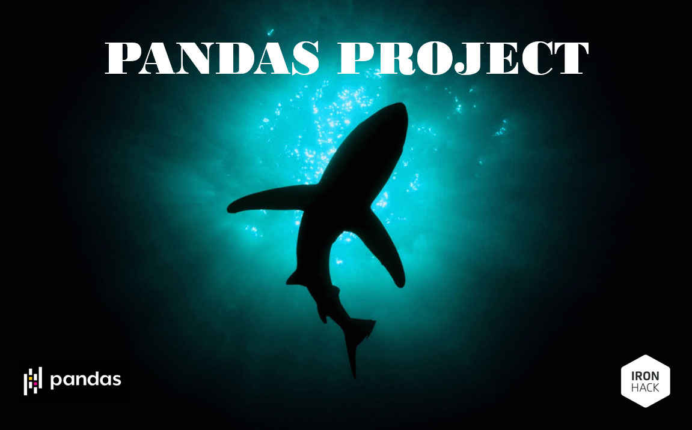

# Pandas Project - Mario Zapatero Acal

Este proyecto surge a partir de una base de datos ([Global Shark Attacks](https://www.kaggle.com/teajay/global-shark-attacks)) acerca del histórico de ataques de tiburón a humanos en todo el mundo.

En base a la información disponible, se plantean dos **hipótesis** que pretenden dar respuesta a dos de los mayores clichés entorno a los ataques de estos animales:

    1. "Los surfistas son la principal víctima humana de los tiburones."
    
    2. "La mayoría de los ataques de tiburón a humanos en el mundo provocan la muerte de la víctima."
    
El **objetivo** del proyecto es comprobar si estas dos hipótesis se cumplen o no, siempre en base a los datos disponibles.

Para ello, el desarrollo del proyecto se estructura en tres **etapas clave**:

    * Análisis exploratorio: exploración inicial para comprender los datos y la información que nos aportan.
    
    * Limpieza de datos: los datos utilizados para la elaboración de este proyecto contienen información de mucho valor, pero son muy diversos y están mal estructurados (hay muchos valores nulos y no existe una normalización de los datos, lo cual implica muchos problemas a la hora de explotarlos). Por ello, será fundamental pasar por una etapa de limpieza que nos permita trabajar y extraer conclusiones. Quizá esta etapa sea la más importantes para poder alcanzar el objetivo y también la que mayr carga de trabajo supone.
    
    * Visualización de resultados: se refiere a la elaboración de diferentes gráficos que aporten información de valor y nos permitan alcanzar el objetivo del proyecto (comprobar si las hipótesis planteadas se corresponden con la realidad).

Como resultado final, apoyándonos en los datos disponibles y diferentes visualizaciones sobre ellos, comprobaremos cada una de la hipótesis planteadas y (AVISO de mini SPOILER) nos llevaremos alguna sorpresa.

Te animo a echarle un vistazo si quieres estar un poquito más cerca de convertirte en un experto en tiburones y sus temidos ataques a humanos (quizá hasta puedas hacerte el listillo delante de tus colegas 😉).

¡Muchas gracias y hasta pronto!

Anexos:
    Librerías utilizadas:
    
        - Manejo de DataFrames: pandas.
        
        - Visualización: plotly.express.